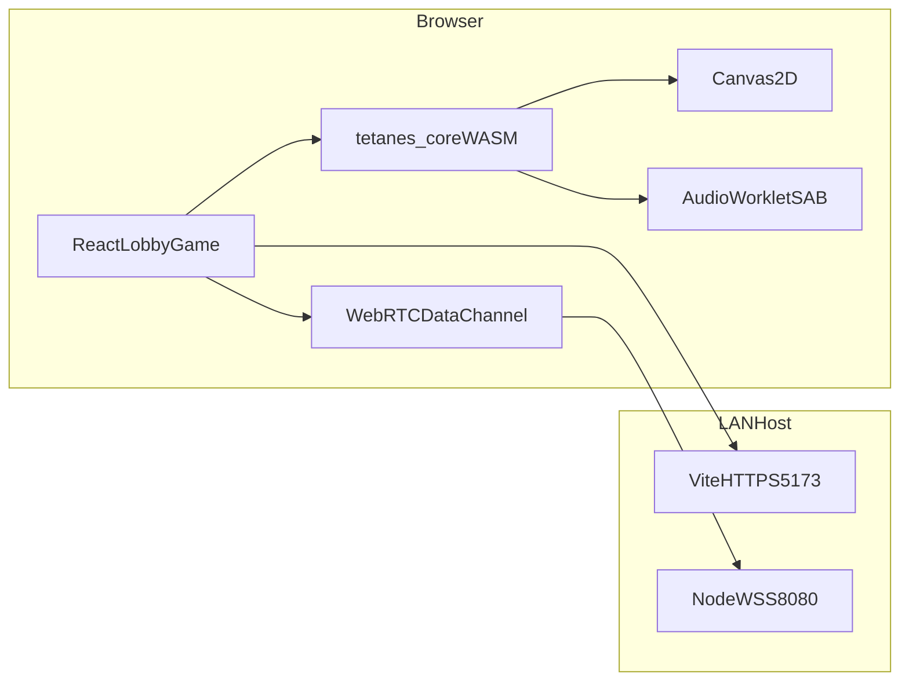

# Contra Online MVP

魂斗罗网页版局域网联机 MVP：**Rust WASM NES 核心 + WebRTC Lockstep + AudioWorklet + IndexedDB ROM**。

## 架构



## 前置依赖

- Node.js 20+
- Rust + wasm-pack
- mkcert（局域网 HTTPS，启用 SharedArrayBuffer）

```bash
brew install mkcert nss
mkcert -install
npm run setup:certs
```

## 开发

```bash
npm install
npm run build:wasm   # 可选：修改 crates/contra-wasm 后需重新编译；仓库已含预编译 pkg
npm run dev          # 同时启动 web + signaling
```

默认地址（证书生成后）：

- 前端：`https://<局域网IP>:5173`
- 信令：`wss://<局域网IP>:8080`

## 使用流程

1. 两台设备连接同一 Wi-Fi
2. 两台设备都信任 mkcert 根证书（`mkcert -install` 所在机器已安装即可，其他设备需导入 CA）
3. 浏览器打开 `https://<主机IP>:5173`
4. 当前开发版已**内置魂斗罗 ROM**，无需上传
5. 玩家 A 创建房间 (P1)，玩家 B 加入同房间号 (P2)
6. WebRTC 直连后 Lockstep 同步按键

## 按键

| 玩家 | 移动 | A | B | Start | Select |
|------|------|---|---|-------|--------|
| P1 | WASD | K | J | Enter | Space |
| P2 | 方向键 | Numpad1 | Numpad2 | NumpadEnter | Numpad0 |

## 模块说明

| 路径 | 作用 |
|------|------|
| `crates/contra-wasm` | tetanes_core WASM 封装 |
| `apps/web` | React 前端、Canvas、AudioWorklet、WebRTC |
| `apps/signaling` | 房间 + SDP/ICE 转发 |
| `certs/` | mkcert 本地 HTTPS 证书 |

## 构建

```bash
npm run build
```

## 注意事项

- **ROM 来源**：开发阶段内置 `public/roms/contra.nes`；部署时把 `apps/web/src/config/rom.ts` 中 `ROM_SOURCE` 改为 `"upload"` 并恢复大厅上传 UI。
- **ROM 版权**：请仅在你有权使用的环境中运行；本项目不提供公开分发 ROM。
- **COOP/COEP**：Vite 已配置，启用 SharedArrayBuffer；第三方 CDN 资源需带 CORP 头。
- **无 TURN（默认）**：未设置 `VITE_ICE_SERVERS` 时仅局域网 host 直连；跨城需 Coturn。
- **确定性**：WASM 核心使用 `RamState::AllZeros`；游戏页可点「确定性自检」验证重放 hash 一致。

## 公网部署

**你的环境**

| 组件 | 地址 |
|------|------|
| 前端（Cloudflare Pages） | `https://nes.zachuse.top` |
| 信令（腾讯云） | `wss://signal.zachuse.top/ws` → `43.136.63.40` |
| STUN/TURN | `coturn.zachuse.top:3478` → `43.136.63.40` |

### 前端 → Cloudflare Pages

**逐步清单（推荐从这里开始）：** **[scripts/deploy/DEPLOY-STEPS.md](scripts/deploy/DEPLOY-STEPS.md)**

摘要文档：[CLOUDFLARE-PAGES.md](scripts/deploy/CLOUDFLARE-PAGES.md) · 服务器：[README.md](scripts/deploy/README.md)

| Pages 构建设置 | 值 |
|----------------|-----|
| Build command | `npm ci && npm run build -w apps/web` |
| Output directory | `apps/web/dist` |
| Node | `20` |

Production 环境变量： 

```bash
VITE_SIGNALING_URL=wss://signal.zachuse.top/ws
VITE_ICE_SERVERS=[{"urls":"stun:coturn.zachuse.top:3478"},{"urls":"turn:coturn.zachuse.top:3478","username":"contra","credential":"与Coturn相同密码"}]
```

自定义域绑定 `nes.zachuse.top`。`signal` / `coturn` 子域 **A 记录到 43.136.63.40 且关闭 CF 代理（灰云）**。

### 后端 → 腾讯云轻量（OpenCloudOS 9）

信令 + Coturn：**[scripts/deploy/DEPLOY-STEPS.md](scripts/deploy/DEPLOY-STEPS.md)**（`dnf`、EPEL、`/etc/coturn/`、`/etc/nginx/conf.d/`）。

```
https://nes.zachuse.top              → Cloudflare Pages
wss://signal.zachuse.top/ws      → Nginx → Node :8080
stun/turn:coturn.zachuse.top:3478  → Coturn
```

### 验证

1. **https://nes.zachuse.top** 打开游戏（Pages）
2. 大厅信令为 `wss://signal.zachuse.top/ws`
3. [Trickle ICE](https://webrtc.github.io/samples/src/content/peerconnection/trickle-ice/) 出现 **relay**
4. 两人跨网同房，WRAM hash 一致

## 后续扩展

- Rollback 网帧（代码在 `apps/web/src/net/rollback.ts`，公网高延迟时可切换）
- Redis / PostgreSQL 持久化
- 手柄 / 触控
